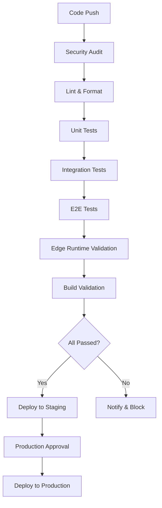

# DevOps CI/CD Modernization Tasks for devops-todo-specialist Agent

## Critical CI/CD Pipeline Implementation

### Context
The application has been modernized for Edge Runtime compatibility with new tooling (ESLint 9+, modern test infrastructure, dual database clients). The DevOps specialist needs to implement the comprehensive CI/CD pipeline and deployment automation.

### High-Priority Tasks

#### 1. GitHub Actions Workflow Implementation
**File**: `.github/workflows/ci-cd-validation.yml` ✅ (Created)
**Status**: Ready for implementation and testing

**Tasks**:
- [ ] **Deploy the workflow** to the repository
- [ ] **Configure secrets** for CI/CD environment
- [ ] **Test all workflow stages** in development
- [ ] **Optimize build times** and parallel execution

**Required Secrets**:
```yaml
NEXT_PUBLIC_INSTANT_APP_ID: "demo-test-id" # For testing
OPENAI_API_KEY: "sk-test-key" # Mock API key for builds
NEXTAUTH_SECRET: "test-secret" # Session secret
CODECOV_TOKEN: "xxx" # For coverage uploads (optional)
```

#### 2. Environment Configuration Management
**Priority**: CRITICAL - Required for deployment

**Tasks**:
- [ ] **Create environment files** for each stage
- [ ] **Set up secure secret management**
- [ ] **Configure deployment variables**
- [ ] **Implement environment validation**

**Environment Structure**:
```
environments/
├── development.env
├── staging.env
├── production.env
└── testing.env
```

**Required Variables per Environment**:
```bash
# Core Application
NODE_ENV=production
NEXT_PUBLIC_APP_URL=https://eduhu.app

# Database
NEXT_PUBLIC_INSTANT_APP_ID=xxx
INSTANT_ADMIN_TOKEN=xxx

# Authentication
NEXTAUTH_URL=https://eduhu.app
NEXTAUTH_SECRET=xxx

# Storage
AWS_ACCESS_KEY_ID=xxx
AWS_SECRET_ACCESS_KEY=xxx
AWS_REGION=us-east-1
AWS_S3_BUCKET=eduhu-files

# API Services
OPENAI_API_KEY=xxx
OPENAI_ORG_ID=xxx

# Monitoring
SENTRY_DSN=xxx
ANALYTICS_ID=xxx
```

#### 3. Edge Runtime Deployment Configuration
**Files**: `next.config.js`, `vercel.json`
**Status**: Partially configured, needs optimization

**Tasks**:
- [ ] **Optimize Next.js config** for Edge Runtime
- [ ] **Configure deployment platform** settings
- [ ] **Set up CDN** and caching strategies
- [ ] **Implement health checks** and monitoring

**Next.js Config Updates**:
```javascript
// Add to next.config.js
experimental: {
  runtime: 'edge',
  regions: ['iad1', 'sfo1'], // Specify regions
},
images: {
  // Optimize for Edge Runtime
  loader: 'custom',
  loaderFile: './src/lib/edge-image-loader.js'
}
```

#### 4. Comprehensive Testing Pipeline
**Status**: Infrastructure created, needs optimization

**Tasks**:
- [ ] **Optimize test execution** for CI/CD
- [ ] **Implement test result reporting**
- [ ] **Set up coverage thresholds**
- [ ] **Configure flaky test handling**

### Medium-Priority Tasks

#### 5. Security and Compliance Automation
**Tasks**:
- [ ] **Implement security scanning** in CI/CD
- [ ] **Add dependency vulnerability** checking
- [ ] **Set up SAST/DAST** scanning
- [ ] **Create security policy** enforcement

**Security Tools Integration**:
```yaml
# Add to workflow
- name: Security Scan
  uses: github/super-linter@v4
  with:
    default_branch: main
    github_token: ${{ secrets.GITHUB_TOKEN }}

- name: Dependency Check
  run: |
    npm audit --audit-level high
    npx audit-ci --config audit-ci.json
```

#### 6. Performance and Bundle Analysis
**Tasks**:
- [ ] **Set up bundle size** monitoring
- [ ] **Implement performance** benchmarks
- [ ] **Configure Core Web Vitals** tracking
- [ ] **Create performance regression** alerts

#### 7. Multi-Environment Deployment Strategy
**Environments**: Development → Staging → Production

**Tasks**:
- [ ] **Configure automatic deployments** for development
- [ ] **Set up manual approval** for staging
- [ ] **Implement production** deployment gates
- [ ] **Create rollback** procedures

### Technical Implementation Details

#### CI/CD Pipeline Architecture


#### Deployment Strategy
```yaml
# Deployment matrix
deploy:
  strategy:
    matrix:
      environment: [staging, production]
      region: [us-east-1, us-west-2, eu-west-1]
  runs-on: ubuntu-latest
  environment: ${{ matrix.environment }}
```

#### Performance Monitoring Setup
```javascript
// Performance tracking configuration
const performanceConfig = {
  metrics: ['FCP', 'LCP', 'CLS', 'FID', 'TTFB'],
  thresholds: {
    'Core Web Vitals': {
      LCP: 2500,
      FID: 100,
      CLS: 0.1
    }
  },
  alerting: {
    channels: ['slack', 'email'],
    frequency: 'daily'
  }
}
```

### Infrastructure Requirements

#### Hosting Platform Configuration
**Recommended**: Vercel (Edge Runtime optimized)

**Configuration**:
```json
{
  "buildCommand": "npm run build",
  "outputDirectory": ".next",
  "installCommand": "npm ci",
  "functions": {
    "src/app/api/**/*.ts": {
      "runtime": "edge"
    }
  },
  "regions": ["iad1", "sfo1"],
  "env": {
    "NODE_ENV": "production"
  }
}
```

#### Alternative: AWS Lambda@Edge
```yaml
# AWS SAM template
Resources:
  EdgeFunction:
    Type: AWS::CloudFront::Function
    Properties:
      FunctionCode: |
        function handler(event) {
          // Next.js Edge Runtime handler
        }
      FunctionConfig:
        Runtime: cloudfront-js-1.0
```

### Monitoring and Observability

#### Application Performance Monitoring
**Tools**: Sentry, DataDog, or New Relic

**Implementation**:
- [ ] **Error tracking** and alerting
- [ ] **Performance metrics** collection
- [ ] **User experience** monitoring
- [ ] **Infrastructure metrics** tracking

#### Log Aggregation
```javascript
// Centralized logging configuration
const loggingConfig = {
  level: process.env.LOG_LEVEL || 'info',
  format: 'json',
  transports: [
    new winston.transports.Console(),
    new winston.transports.File({ filename: 'app.log' })
  ],
  meta: {
    service: 'eduhu-app',
    version: process.env.npm_package_version
  }
}
```

### Testing and Quality Gates

#### Coverage Requirements
```javascript
// jest.config.js coverage thresholds
coverageThreshold: {
  global: {
    branches: 80,
    functions: 80,
    lines: 80,
    statements: 80,
  },
  // Block deployment if critical paths fall below 90%
  './src/app/api/': {
    branches: 90,
    functions: 90,
    lines: 90,
    statements: 90,
  }
}
```

#### Quality Gates
1. **Security**: No high/critical vulnerabilities
2. **Performance**: Bundle size < 500KB gzipped
3. **Testing**: Coverage > 80% overall, > 90% for critical paths
4. **Linting**: Zero ESLint errors
5. **TypeScript**: No compilation errors

### Deployment Automation

#### Feature Branch Strategy
```yaml
on:
  push:
    branches: ['feature/*', 'hotfix/*']
  # Deploy to preview environment

  push:
    branches: ['develop']
  # Deploy to staging automatically

  push:
    branches: ['main']
  # Deploy to production with approval
```

#### Release Management
```bash
# Automated release process
npm version minor  # Update version
git push origin main --tags  # Trigger production deployment
npm run release:notes  # Generate release notes
```

### Success Criteria

#### Deployment Metrics
1. **Build Time**: < 5 minutes for full pipeline
2. **Test Execution**: < 10 minutes for complete suite
3. **Deployment Time**: < 2 minutes to production
4. **Zero-Downtime**: Deployment success rate > 99.9%

#### Quality Metrics
1. **Test Coverage**: > 80% maintained
2. **Security Scan**: Zero high/critical issues
3. **Performance**: Core Web Vitals all green
4. **Error Rate**: < 0.1% in production

### Risk Mitigation

#### Deployment Risks
1. **Edge Runtime Compatibility**: Validate in staging first
2. **Database Migration**: Blue-green deployment strategy
3. **Third-party Services**: Circuit breaker patterns
4. **Performance Regression**: Automated rollback triggers

#### Monitoring and Alerting
```yaml
# Alert conditions
alerts:
  - name: "High Error Rate"
    condition: "error_rate > 1%"
    duration: "5m"

  - name: "Slow Response Time"
    condition: "p95_response_time > 1000ms"
    duration: "10m"

  - name: "Build Failure"
    condition: "build_status == 'failed'"
    immediate: true
```

### Integration Points

#### Dependencies
- **Backend Agent**: Database migration coordination
- **QA Agent**: Test implementation and validation
- **Project Lead**: Architecture decisions and approvals

#### External Services
- GitHub Actions runners
- Cloud hosting platform (Vercel/AWS)
- Monitoring services (Sentry, DataDog)
- CDN and caching (CloudFlare)

### Timeline

#### Phase 1 (Immediate - 1-2 days)
- [ ] Deploy GitHub Actions workflow
- [ ] Configure environment variables
- [ ] Test CI/CD pipeline end-to-end

#### Phase 2 (Medium-term - 3-5 days)
- [ ] Implement security scanning
- [ ] Set up monitoring and alerting
- [ ] Configure multi-environment deployment

#### Phase 3 (Long-term - 1 week)
- [ ] Optimize performance and costs
- [ ] Implement advanced monitoring
- [ ] Create disaster recovery procedures